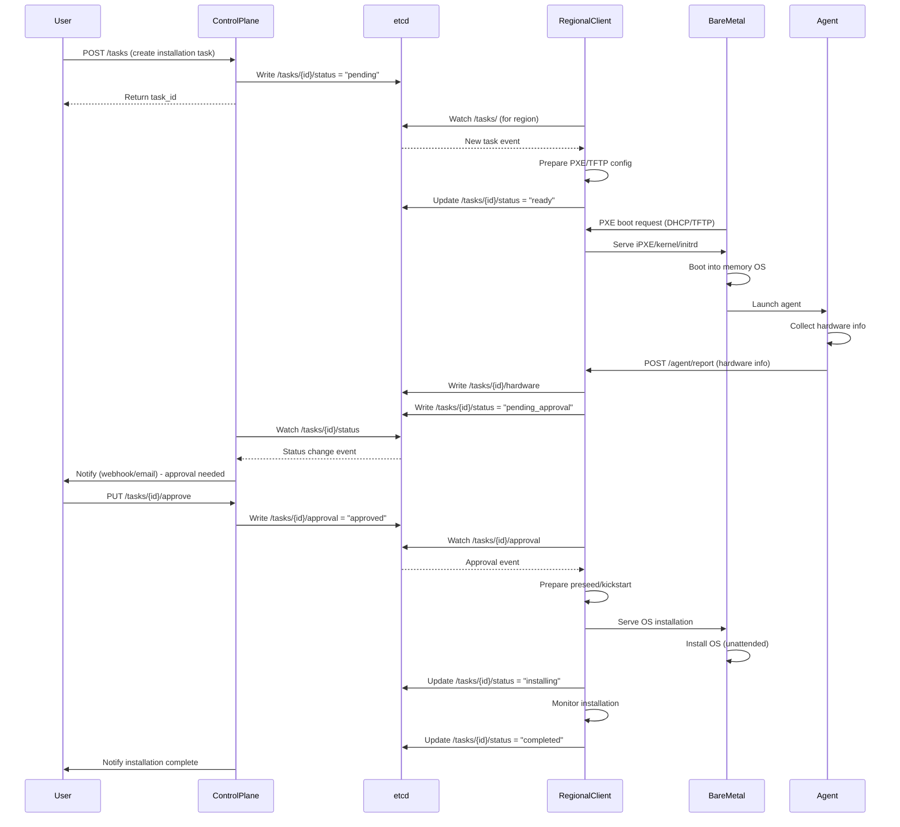

# LPMOS - Large-scale PXE-based Multi-region OS Provisioning System

## 1. Architecture Overview

```
┌─────────────────────────────────────────────────────────────────────┐
│                         Central Control Plane                        │
│  ┌──────────────┐     ┌──────────────┐     ┌──────────────┐        │
│  │   REST API   │────▶│  Orchestrator│────▶│ etcd Client  │        │
│  │  (Gin/HTTP)  │     │   (Tasks)    │     │              │        │
│  └──────────────┘     └──────────────┘     └──────┬───────┘        │
│         │                                           │                │
└─────────┼───────────────────────────────────────────┼────────────────┘
          │                                           │
          │ API Calls                                 │ Watch/Update
          │ (Task Create/Approve)                     │
          │                                           │
          ▼                                           ▼
   ┌─────────────┐                         ┌──────────────────┐
   │    Users    │                         │      etcd        │
   │ (Operators) │                         │   (Cluster)      │
   └─────────────┘                         │                  │
                                           │ /tasks/          │
                                           │ /regions/        │
                                           │ /agents/         │
                                           └────────┬─────────┘
                                                    │
                   ┌────────────────────────────────┴─────────────────┐
                   │                                                  │
                   │ Watch Tasks                      Watch Tasks     │
                   ▼                                                  ▼
        ┌──────────────────────────┐                  ┌──────────────────────────┐
        │   Regional Client (DC1)   │                  │   Regional Client (DC2)   │
        │  ┌────────────────────┐  │                  │  ┌────────────────────┐  │
        │  │ etcd Watcher       │  │                  │  │ etcd Watcher       │  │
        │  ├────────────────────┤  │                  │  ├────────────────────┤  │
        │  │ PXE/TFTP Service   │  │                  │  │ PXE/TFTP Service   │  │
        │  ├────────────────────┤  │                  │  ├────────────────────┤  │
        │  │ HTTP Boot Service  │  │                  │  │ HTTP Boot Service  │  │
        │  ├────────────────────┤  │                  │  ├────────────────────┤  │
        │  │ Install Orchestr.  │  │                  │  │ Install Orchestr.  │  │
        │  └────────────────────┘  │                  │  └────────────────────┘  │
        └───────────┬──────────────┘                  └───────────┬──────────────┘
                    │                                              │
                    │ PXE Boot                                     │ PXE Boot
                    │ & Agent Deploy                               │ & Agent Deploy
                    ▼                                              ▼
          ┌──────────────────┐                            ┌──────────────────┐
          │  Bare Metal       │                            │  Bare Metal       │
          │  Server 1         │                            │  Server 3         │
          │  ┌────────────┐  │                            │  ┌────────────┐  │
          │  │ Boot Agent │──┼──────┐                     │  │ Boot Agent │──┼──────┐
          │  └────────────┘  │      │                     │  └────────────┘  │      │
          └──────────────────┘      │                     └──────────────────┘      │
                                    │                                               │
          ┌──────────────────┐      │                     ┌──────────────────┐      │
          │  Bare Metal       │      │                     │  Bare Metal       │      │
          │  Server 2         │      │                     │  Server 4         │      │
          │  ┌────────────┐  │      │                     │  ┌────────────┐  │      │
          │  │ Boot Agent │──┼──────┤                     │  │ Boot Agent │──┼──────┤
          │  └────────────┘  │      │                     │  └────────────┘  │      │
          └──────────────────┘      │                     └──────────────────┘      │
                                    │                                               │
                                    │ Hardware Report                               │
                                    │ (via Regional Client)                         │
                                    │                                               │
                                    └───────────────┬───────────────────────────────┘
                                                    │
                                                    ▼
                                          Update etcd
                                    /tasks/<id>/hardware
```

### Data Flow Sequence



## 2. Components

### 2.1 Control Plane (Central Server)

**Location**: Central data center or cloud
**Responsibilities**:
- Expose REST API for task management
- Create and manage installation tasks in etcd
- Handle user approvals and notifications
- Monitor overall system health
- Provide dashboard/UI (optional)

**Key Golang Packages**:
- `github.com/gin-gonic/gin` - HTTP API server
- `go.etcd.io/etcd/client/v3` - etcd client
- `context` - Request/task context management
- `github.com/google/uuid` - Task ID generation
- `crypto/tls` - Secure communications

**Communication**:
- Inbound: REST API from users/operators
- Outbound: etcd read/write operations
- Watches: Task status changes for notifications

### 2.2 Regional Client

**Location**: Each data center/region
**Responsibilities**:
- Run PXE/DHCP/TFTP services for network booting
- Run HTTP server for serving OS images and agents
- Watch etcd for tasks assigned to the region
- Orchestrate OS installation process
- Relay agent reports to etcd
- Handle local error recovery

**Key Golang Packages**:
- `go.etcd.io/etcd/client/v3` - etcd client
- `net/http` - HTTP server for boot files
- `github.com/pin/tftp/v3` - TFTP server
- `os/exec` - Execute dhcpd, iPXE tools
- `text/template` - Generate preseed/kickstart configs

**Communication**:
- Inbound: Agent HTTP reports, PXE boot requests
- Outbound: etcd watches and updates
- Services: DHCP (67/UDP), TFTP (69/UDP), HTTP (80/TCP)

### 2.3 Boot Agent

**Location**: Runs in-memory on target bare-metal server
**Responsibilities**:
- Collect hardware information (CPU, RAM, disks, NICs)
- Report MAC address and hardware details
- Receive installation commands
- Provide installation progress feedback

**Key Golang Packages**:
- `net/http` - HTTP client for reporting
- `os/exec` - Execute dmidecode, lshw, lsblk
- `encoding/json` - Serialize hardware info
- `github.com/shirou/gopsutil` - System info collection

**Communication**:
- Outbound: HTTP POST to regional client API
- Protocol: JSON over HTTP/HTTPS

### 2.4 etcd Cluster

**Location**: Distributed across multiple availability zones
**Responsibilities**:
- Store task state and metadata
- Coordinate between control plane and regional clients
- Provide watch mechanism for real-time updates
- Ensure consistency and fault tolerance

**Configuration**:
- Cluster size: 3-5 nodes for production
- TLS: Enabled for client and peer communication
- Authentication: Client certificate or username/password

## 3. etcd Key Schema

### Hierarchical Structure

```
/lpmos/
├── tasks/
│   ├── {task_id}/
│   │   ├── metadata          # Task configuration (JSON)
│   │   ├── status            # Current status (string)
│   │   ├── hardware          # Reported hardware info (JSON)
│   │   ├── approval          # Approval status (JSON)
│   │   ├── logs              # Installation logs (string)
│   │   └── error             # Error information (JSON)
│   └── ...
├── regions/
│   ├── {region_id}/
│   │   ├── client/
│   │   │   ├── heartbeat     # Last heartbeat timestamp
│   │   │   ├── status        # online/offline
│   │   │   └── capabilities  # Supported OS, services (JSON)
│   │   └── tasks/            # Task assignments (TTL keys)
│   │       └── {task_id}     # Empty key for assignment
│   └── ...
├── agents/
│   ├── {mac_address}/
│   │   ├── info              # Agent metadata (JSON)
│   │   ├── last_seen         # Timestamp
│   │   └── task_id           # Associated task
│   └── ...
└── config/
    ├── global/               # Global configuration
    └── templates/            # Preseed/kickstart templates
```

### Key Examples and Schemas

#### Task Metadata
```
Key: /lpmos/tasks/550e8400-e29b-41d4-a716-446655440000/metadata
Value (JSON):
{
  "id": "550e8400-e29b-41d4-a716-446655440000",
  "region_id": "dc1",
  "target_mac": "00:1a:2b:3c:4d:5e",
  "os_type": "ubuntu",
  "os_version": "22.04",
  "disk_layout": "auto",
  "network_config": "dhcp",
  "created_at": "2026-01-29T10:00:00Z",
  "created_by": "admin@example.com",
  "tags": {
    "environment": "production",
    "purpose": "web-server"
  }
}
```

#### Task Status
```
Key: /lpmos/tasks/550e8400-e29b-41d4-a716-446655440000/status
Value: "pending" | "ready" | "booting" | "pending_approval" |
       "approved" | "installing" | "completed" | "failed"
```

#### Hardware Report
```
Key: /lpmos/tasks/550e8400-e29b-41d4-a716-446655440000/hardware
Value (JSON):
{
  "mac_address": "00:1a:2b:3c:4d:5e",
  "cpu": {
    "model": "Intel Xeon E5-2680 v4",
    "cores": 28,
    "threads": 56
  },
  "memory": {
    "total_gb": 256,
    "dimms": [
      {"slot": "A1", "size_gb": 16, "type": "DDR4", "speed_mhz": 2400}
    ]
  },
  "disks": [
    {"device": "/dev/sda", "size_gb": 480, "type": "SSD", "model": "Samsung 860 PRO"},
    {"device": "/dev/sdb", "size_gb": 2000, "type": "HDD", "model": "Seagate ST2000"}
  ],
  "network": [
    {"interface": "eth0", "mac": "00:1a:2b:3c:4d:5e", "speed": "10Gbps"},
    {"interface": "eth1", "mac": "00:1a:2b:3c:4d:5f", "speed": "10Gbps"}
  ],
  "bios": {
    "vendor": "Dell Inc.",
    "version": "2.10.0",
    "serial": "SN123456"
  },
  "collected_at": "2026-01-29T10:05:30Z"
}
```

#### Approval Status
```
Key: /lpmos/tasks/550e8400-e29b-41d4-a716-446655440000/approval
Value (JSON):
{
  "status": "approved" | "rejected" | "pending",
  "approved_by": "admin@example.com",
  "approved_at": "2026-01-29T10:10:00Z",
  "notes": "Hardware verified, proceed with installation"
}
```

#### Regional Client Heartbeat
```
Key: /lpmos/regions/dc1/client/heartbeat
Value: "2026-01-29T10:00:00Z"
TTL: 30 seconds
```

### Watch Patterns

**Control Plane Watches**:
- `/lpmos/tasks/` with prefix - Monitor all task status changes
- `/lpmos/regions/{region_id}/client/heartbeat` - Monitor client health

**Regional Client Watches**:
- `/lpmos/regions/{region_id}/tasks/` - Get assigned tasks
- `/lpmos/tasks/{task_id}/approval` - Wait for user approval

**Agent Watches**: (Optional, if agents maintain connection)
- `/lpmos/tasks/{task_id}/status` - Monitor installation commands

## 4. APIs

### 4.1 Control Plane REST API

**Base URL**: `https://control-plane.example.com/api/v1`

#### Create Installation Task

```
POST /tasks
Content-Type: application/json
Authorization: Bearer <token>

Request:
{
  "region_id": "dc1",
  "target_mac": "00:1a:2b:3c:4d:5e",
  "os_type": "ubuntu",
  "os_version": "22.04",
  "disk_layout": "auto",
  "network_config": "dhcp",
  "tags": {
    "environment": "production"
  }
}

Response: 201 Created
{
  "task_id": "550e8400-e29b-41d4-a716-446655440000",
  "status": "pending",
  "created_at": "2026-01-29T10:00:00Z",
  "links": {
    "self": "/api/v1/tasks/550e8400-e29b-41d4-a716-446655440000",
    "approve": "/api/v1/tasks/550e8400-e29b-41d4-a716-446655440000/approve"
  }
}
```

#### Get Task Details

```
GET /tasks/{task_id}
Authorization: Bearer <token>

Response: 200 OK
{
  "task_id": "550e8400-e29b-41d4-a716-446655440000",
  "status": "pending_approval",
  "metadata": {
    "region_id": "dc1",
    "target_mac": "00:1a:2b:3c:4d:5e",
    "os_type": "ubuntu",
    "os_version": "22.04"
  },
  "hardware": {
    "cpu": {"model": "Intel Xeon E5-2680 v4", "cores": 28},
    "memory": {"total_gb": 256},
    "disks": [
      {"device": "/dev/sda", "size_gb": 480, "type": "SSD"}
    ]
  },
  "timeline": [
    {"timestamp": "2026-01-29T10:00:00Z", "event": "task_created"},
    {"timestamp": "2026-01-29T10:05:30Z", "event": "hardware_reported"}
  ]
}
```

#### List Tasks

```
GET /tasks?region_id=dc1&status=pending_approval&limit=50&offset=0
Authorization: Bearer <token>

Response: 200 OK
{
  "tasks": [
    {
      "task_id": "550e8400-e29b-41d4-a716-446655440000",
      "status": "pending_approval",
      "region_id": "dc1",
      "created_at": "2026-01-29T10:00:00Z"
    }
  ],
  "total": 1,
  "limit": 50,
  "offset": 0
}
```

#### Approve Task

```
PUT /tasks/{task_id}/approve
Content-Type: application/json
Authorization: Bearer <token>

Request:
{
  "approved": true,
  "notes": "Hardware verified, proceed with installation"
}

Response: 200 OK
{
  "task_id": "550e8400-e29b-41d4-a716-446655440000",
  "approval": {
    "status": "approved",
    "approved_by": "admin@example.com",
    "approved_at": "2026-01-29T10:10:00Z"
  },
  "next_status": "installing"
}
```

#### Reject Task

```
PUT /tasks/{task_id}/reject
Content-Type: application/json
Authorization: Bearer <token>

Request:
{
  "reason": "Insufficient disk space"
}

Response: 200 OK
{
  "task_id": "550e8400-e29b-41d4-a716-446655440000",
  "approval": {
    "status": "rejected",
    "rejected_by": "admin@example.com",
    "rejected_at": "2026-01-29T10:10:00Z",
    "reason": "Insufficient disk space"
  }
}
```

#### Cancel Task

```
DELETE /tasks/{task_id}
Authorization: Bearer <token>

Response: 204 No Content
```

### 4.2 Regional Client API (Internal)

**Base URL**: `http://regional-client.dc1.internal:8081/api/v1`

#### Agent Hardware Report

```
POST /agent/report
Content-Type: application/json

Request:
{
  "mac_address": "00:1a:2b:3c:4d:5e",
  "hardware": {
    "cpu": {...},
    "memory": {...},
    "disks": [...],
    "network": [...]
  }
}

Response: 200 OK
{
  "status": "received",
  "task_id": "550e8400-e29b-41d4-a716-446655440000",
  "next_action": "wait_for_approval"
}
```

#### Agent Status Update

```
POST /agent/status
Content-Type: application/json

Request:
{
  "mac_address": "00:1a:2b:3c:4d:5e",
  "task_id": "550e8400-e29b-41d4-a716-446655440000",
  "status": "installing",
  "progress": 45,
  "message": "Installing packages..."
}

Response: 200 OK
```

#### Health Check

```
GET /health

Response: 200 OK
{
  "status": "healthy",
  "region_id": "dc1",
  "services": {
    "dhcp": "running",
    "tftp": "running",
    "http": "running"
  },
  "etcd_connected": true,
  "last_heartbeat": "2026-01-29T10:00:00Z"
}
```

## 5. Security Considerations

### 5.1 Authentication & Authorization
- **Control Plane API**: Bearer token authentication (JWT) with RBAC
- **etcd**: Client certificate authentication (mTLS)
- **Regional Client API**: API key authentication for agents
- **Agent**: Unique token embedded in boot image, rotated per task

### 5.2 Network Security
- **TLS Everywhere**: All communications use TLS 1.3
- **Network Segmentation**: Regional clients in isolated VLANs
- **Firewall Rules**: Whitelist only necessary ports
- **VPN/WireGuard**: Optional tunnel between regions and control plane

### 5.3 Data Protection
- **Sensitive Data**: Encrypt credentials in etcd (disk encryption + application-level)
- **Audit Logging**: All API calls and task operations logged
- **Secrets Management**: Integration with Vault/AWS Secrets Manager

### 5.4 Agent Security
- **Signed Boot Images**: iPXE images signed with code signing certificate
- **Minimal Attack Surface**: Agent runs in read-only memory filesystem
- **Time-Limited Tokens**: Agent tokens expire after task completion

## 6. Fault Tolerance

### 6.1 etcd High Availability
- 3-5 node cluster with leader election
- Automatic failover on node failure
- Regular backups to object storage

### 6.2 Regional Client Redundancy
- Active-passive pair in each region
- Health checks with automatic failover
- Lease-based task assignment (prevent split-brain)

### 6.3 Error Handling
- **Task Timeout**: Auto-fail tasks after configurable duration
- **Retry Logic**: Automatic retry with exponential backoff
- **Dead Letter Queue**: Failed tasks moved to DLQ for investigation
- **Rollback**: Ability to revert to previous state on failure

### 6.4 Monitoring & Alerting
- Prometheus metrics export from all components
- Alerts on task failures, client disconnections, etcd issues
- Distributed tracing with OpenTelemetry

## 7. Scalability

### 7.1 Horizontal Scaling
- **Control Plane**: Stateless API servers behind load balancer
- **Regional Clients**: One per region, handles 100s of concurrent tasks
- **etcd**: Scale reads with learner nodes

### 7.2 Performance Optimization
- **etcd Watches**: Use watch with filters to reduce traffic
- **Batch Operations**: Group multiple etcd writes in transactions
- **Caching**: Cache task states locally in regional clients
- **Connection Pooling**: Reuse HTTP/etcd connections

### 7.3 Capacity Planning
- **etcd**: ~2GB for 10K tasks with hardware info (+ retention policy)
- **Regional Client**: 1 vCPU per 10 concurrent installations
- **Network**: 100Mbps per concurrent installation (OS image download)

## 8. Future Enhancements

### 8.1 Multi-OS Support
- Templates for Ubuntu, CentOS, Rocky Linux, Debian, RHEL
- Custom OS image support (upload via API)
- Windows support via WinPE

### 8.2 Auto-Approval
- Rule-based approval (e.g., if hardware matches specs)
- ML-based anomaly detection for hardware validation
- Integration with CMDB for automatic verification

### 8.3 Advanced Features
- **RAID Configuration**: Automated disk array setup
- **BIOS/UEFI Configuration**: Remote BIOS settings via IPMI/Redfish
- **Post-Install Automation**: Ansible/Puppet integration
- **Zero-Touch Provisioning**: Automated discovery and provisioning
- **Multi-Tenancy**: Isolated environments for different teams/customers
