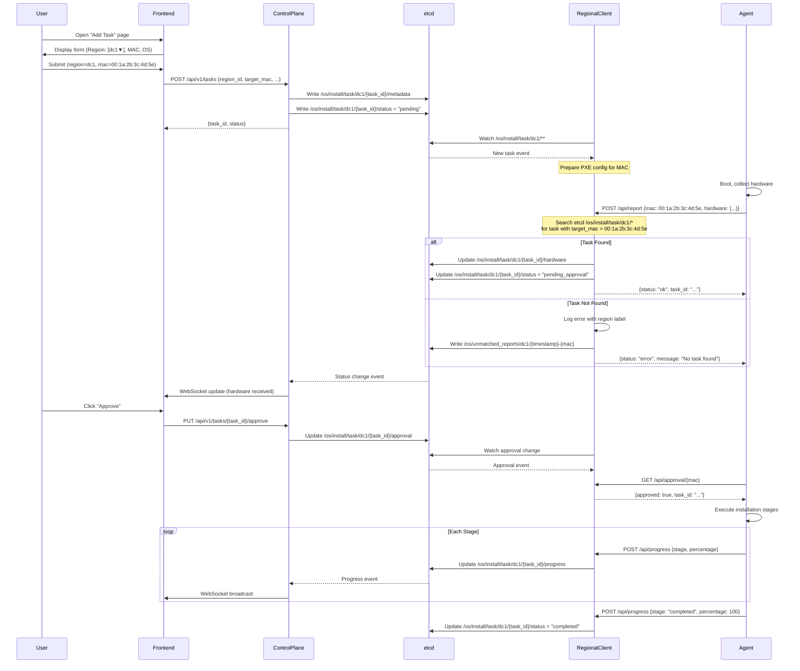

# LPMOS v2.1 - Region-Based Architecture with Fixed Task Matching

## 1. Architecture Overview (Updated)

### High-Level Architecture with Region Labels

```
┌─────────────────────────────────────────────────────────────────┐
│              Control Plane (Full-Stack)                          │
│  ┌──────────────────────────────────────────────────────────┐  │
│  │              Frontend UI                                   │  │
│  │  ┌────────────┐  ┌────────────────────┐  ┌────────────┐  │  │
│  │  │ Dashboard  │  │  Add Task Page     │  │  Approval  │  │  │
│  │  │            │  │  [Region: dc1 ▼]   │  │            │  │  │
│  │  │            │  │  MAC: _________    │  │            │  │  │
│  │  │            │  │  OS: ubuntu 22.04  │  │            │  │  │
│  │  └────────────┘  └────────────────────┘  └────────────┘  │  │
│  └──────────────────────────────────────────────────────────┘  │
│                         │ REST API + WebSocket                  │
│  ┌─────────────────────┴──────────────────────────────────┐   │
│  │  Backend: Watches etcd /os/install/task/*/...          │   │
│  │  Broadcasts updates via WebSocket                       │   │
│  └─────────────────────┬────────────────────────────────┘   │
└─────────────────────────┼────────────────────────────────────┘
                          │
                          ▼
            ┌──────────────────────────────┐
            │          etcd                │
            │                              │
            │  /os/install/task/           │
            │    dc1/                      │
            │      {task_id}/              │
            │        metadata              │
            │        status                │
            │        hardware              │
            │        progress              │
            │        approval              │
            │    dc2/                      │
            │      {task_id}/              │
            │        ...                   │
            │  /os/region/                 │
            │    dc1/heartbeat             │
            │    dc2/heartbeat             │
            └────────┬──────┬──────────────┘
                     │      │
        ┌────────────┘      └────────────┐
        │ Watch                          │ Watch
        │ /os/install/task/dc1/...       │ /os/install/task/dc2/...
        ▼                                ▼
┌──────────────────────────┐    ┌──────────────────────────┐
│ Regional Client          │    │ Regional Client          │
│ [Label: dc1]             │    │ [Label: dc2]             │
│ Port: 8081               │    │ Port: 8082               │
│                          │    │                          │
│ - PXE/TFTP/HTTP services │    │ - PXE/TFTP/HTTP services │
│ - Agent API:             │    │ - Agent API:             │
│   POST /api/report       │    │   POST /api/report       │
│   GET /api/approval/:mac │    │   GET /api/approval/:mac │
│   POST /api/progress     │    │   POST /api/progress     │
│ - Task matching by MAC   │    │ - Task matching by MAC   │
└────────┬─────────────────┘    └────────┬─────────────────┘
         │                                │
         │ PXE Boot                       │ PXE Boot
         │ + Agent Deploy                 │ + Agent Deploy
         ▼                                ▼
┌──────────────────┐              ┌──────────────────┐
│  Bare Metal      │              │  Bare Metal      │
│  (DC1)           │              │  (DC2)           │
│  ┌────────────┐  │              │  ┌────────────┐  │
│  │   Agent    │  │              │  │   Agent    │  │
│  │            │  │              │  │            │  │
│  │ Flags:     │  │              │  │ Flags:     │  │
│  │ --regional-│  │              │  │ --regional-│  │
│  │   url=http:│  │              │  │   url=http:│  │
│  │   //dc1:   │  │              │  │   //dc2:   │  │
│  │   8081     │  │              │  │   8082     │  │
│  │            │  │              │  │            │  │
│  │ 1. Collect │──┼──┐           │  │ 1. Collect │──┼──┐
│  │    HW      │  │  │           │  │    HW      │  │  │
│  │ 2. POST to │  │  │           │  │ 2. POST to │  │  │
│  │    regional│  │  │           │  │    regional│  │  │
│  │ 3. Wait    │  │  │           │  │ 3. Wait    │  │  │
│  │    approval│  │  │           │  │    approval│  │  │
│  │ 4. Install │  │  │           │  │ 4. Install │  │  │
│  │ 5. Report  │──┼──┤           │  │ 5. Report  │──┼──┤
│  │    progress│  │  │           │  │    progress│  │  │
│  └────────────┘  │  │           │  └────────────┘  │  │
└──────────────────┘  │           └──────────────────┘  │
                      │                                 │
                      │ HTTP POST                       │
                      │ {mac, hardware}                 │
                      ▼                                 ▼
                Regional Client                  Regional Client
                      │                                 │
                      │ Match MAC to Task               │
                      │ in /os/install/task/dc1/        │
                      ▼                                 ▼
                Update etcd                       Update etcd
                /os/install/task/dc1/{id}/...    /os/install/task/dc2/{id}/...
```

### Task Matching Flow (Fixed)



## 2. Updated Components

### 2.1 Control Plane (Full-Stack)

**New Features**:
- "Add Task" page with region selector dropdown
- API endpoint accepts `region_id` parameter
- Writes tasks to region-specific etcd paths
- Watches all regions for updates

**Configuration**:
- No region label needed (watches all regions)
- Port: 8080 (default)

**Frontend Pages**:
1. Dashboard: Shows tasks from all regions
2. Add Task: Form with region dropdown
3. Task Detail: Shows region label

### 2.2 Regional Client

**New Configuration**:
- `--label` or `--region-label` flag (required)
- Example: `--label=dc1` or `REGION_LABEL=dc1`

**Updated Functionality**:
- Watches etcd path: `/os/install/task/{label}/**`
- Logs all operations with region label
- Task matching by MAC:
  ```go
  func (rc *RegionalClient) findTaskByMAC(mac string) (*Task, error) {
      // Search in /os/install/task/{rc.label}/*/metadata
      // where target_mac matches (case-insensitive)
  }
  ```

**Error Handling for Unmatched MACs**:
- Log error with region label: `[dc1] No task found for MAC xx:xx:xx:xx:xx:xx`
- Write unmatched report to etcd: `/os/unmatched_reports/{label}/{timestamp}-{mac}`
- Return HTTP 404 to agent with retry instructions
- Optional: Send notification to control plane

**Heartbeat**:
- Write to `/os/region/{label}/heartbeat` with TTL

### 2.3 Agent

**New Configuration**:
- `--regional-url` flag (required)
- Example: `--regional-url=http://regional-dc1:8081`

**Workflow**:
1. Collect hardware (stdlib only)
2. POST to `{regional-url}/api/report`
3. Poll `{regional-url}/api/approval/{mac}`
4. Execute installation
5. POST progress to `{regional-url}/api/progress`

**No Direct etcd Access**: All etcd operations proxied through regional client

### 2.4 Frontend (Add Task Page)

**New Page**: `/tasks/create`

**Form Fields**:
- Region (dropdown): dc1, dc2, dc3, ...
- Target MAC (input)
- OS Type (select): ubuntu, centos, rocky
- OS Version (input)
- Additional options

**JavaScript**:
```javascript
function createTask() {
    const data = {
        region_id: document.getElementById('region').value,
        target_mac: document.getElementById('mac').value,
        os_type: document.getElementById('os_type').value,
        os_version: document.getElementById('os_version').value
    };

    fetch('/api/v1/tasks', {
        method: 'POST',
        headers: {'Content-Type': 'application/json'},
        body: JSON.stringify(data)
    })
    .then(res => res.json())
    .then(data => {
        alert('Task created: ' + data.task_id);
        window.location.href = '/';
    });
}
```

## 3. Updated etcd Key Schema

### Hierarchical Structure

```
/os/
├── install/
│   └── task/
│       ├── dc1/                          # Region: Data Center 1
│       │   ├── {task_id_1}/
│       │   │   ├── metadata              # Task config (JSON)
│       │   │   ├── status                # Current status (string)
│       │   │   ├── hardware              # Hardware report (JSON)
│       │   │   ├── progress              # Install progress (JSON)
│       │   │   └── approval              # Approval status (JSON)
│       │   └── {task_id_2}/
│       │       └── ...
│       ├── dc2/                          # Region: Data Center 2
│       │   └── {task_id_3}/
│       │       └── ...
│       └── dc3/                          # Region: Data Center 3
│           └── ...
├── region/
│   ├── dc1/
│   │   ├── heartbeat                     # Last heartbeat (timestamp, TTL: 30s)
│   │   ├── status                        # online/offline
│   │   └── capabilities                  # Services available (JSON)
│   ├── dc2/
│   │   └── ...
│   └── dc3/
│       └── ...
└── unmatched_reports/                    # Reports without matching tasks
    ├── dc1/
    │   ├── 20260130100009-fe:b7:02:c0:95:e0  # timestamp-mac
    │   │   {hardware: {...}, received_at: "..."}
    │   └── ...
    └── dc2/
        └── ...
```

### Key Examples

#### Task Metadata (Region-Specific)
```
Key: /os/install/task/dc1/550e8400-e29b-41d4-a716-446655440000/metadata
Value (JSON):
{
  "id": "550e8400-e29b-41d4-a716-446655440000",
  "region_id": "dc1",
  "target_mac": "00:1a:2b:3c:4d:5e",
  "os_type": "ubuntu",
  "os_version": "22.04",
  "created_at": "2026-01-30T10:00:00Z",
  "created_by": "admin@example.com"
}
```

#### Task Status
```
Key: /os/install/task/dc1/550e8400-.../status
Value: "pending" | "pending_approval" | "approved" | "installing" | "completed" | "failed"
```

#### Hardware Report
```
Key: /os/install/task/dc1/550e8400-.../hardware
Value (JSON):
{
  "mac_address": "00:1a:2b:3c:4d:5e",
  "cpu": {"model": "Intel Xeon", "cores": 28},
  "memory": {"total_gb": 256},
  "disks": [...],
  "reported_at": "2026-01-30T10:05:00Z"
}
```

#### Unmatched Report (Error Case)
```
Key: /os/unmatched_reports/dc1/20260130100009-fe:b7:02:c0:95:e0
Value (JSON):
{
  "mac_address": "fe:b7:02:c0:95:e0",
  "region": "dc1",
  "hardware": {...},
  "received_at": "2026-01-30T10:00:09Z",
  "error": "No task found for this MAC in region dc1"
}
```

### Watch Patterns

**Control Plane**:
- Watch: `/os/install/task/**/` (all regions)
- Reads from all region paths

**Regional Client (dc1)**:
- Watch: `/os/install/task/dc1/` (only its region)
- Heartbeat: `/os/region/dc1/heartbeat` (write with TTL)

## 4. Updated APIs

### 4.1 Control Plane REST API

#### Create Task (Updated)
```http
POST /api/v1/tasks
Content-Type: application/json

{
  "region_id": "dc1",
  "target_mac": "00:1a:2b:3c:4d:5e",
  "os_type": "ubuntu",
  "os_version": "22.04",
  "disk_layout": "auto"
}

Response: 201 Created
{
  "task_id": "550e8400-...",
  "region_id": "dc1",
  "status": "pending",
  "etcd_path": "/os/install/task/dc1/550e8400-..."
}
```

#### List Tasks (All Regions)
```http
GET /api/v1/tasks?region_id=dc1

Response: 200 OK
{
  "tasks": [
    {
      "task_id": "550e8400-...",
      "region_id": "dc1",
      "target_mac": "00:1a:2b:3c:4d:5e",
      "status": "pending_approval"
    }
  ]
}
```

#### Get Regions
```http
GET /api/v1/regions

Response: 200 OK
{
  "regions": [
    {"id": "dc1", "status": "online", "last_heartbeat": "2026-01-30T10:00:00Z"},
    {"id": "dc2", "status": "online", "last_heartbeat": "2026-01-30T10:00:05Z"}
  ]
}
```

### 4.2 Regional Client API (Agent-Facing)

#### Hardware Report (Fixed)
```http
POST /api/report
Content-Type: application/json

{
  "mac_address": "00:1a:2b:3c:4d:5e",
  "hardware": {
    "cpu": {"model": "...", "cores": 28},
    "memory": {"total_gb": 256},
    "disks": [...],
    "network": [...]
  }
}

Response (Success): 200 OK
{
  "status": "ok",
  "task_id": "550e8400-...",
  "message": "Hardware report received and matched to task"
}

Response (Not Found): 404 Not Found
{
  "status": "error",
  "message": "No task found for MAC 00:1a:2b:3c:4d:5e in region dc1",
  "retry_after": 10
}
```

#### Check Approval
```http
GET /api/approval/{mac_address}

Response (Approved): 200 OK
{
  "approved": true,
  "task_id": "550e8400-...",
  "install_config": {
    "os_type": "ubuntu",
    "os_version": "22.04"
  }
}

Response (Not Approved): 200 OK
{
  "approved": false,
  "task_id": "550e8400-...",
  "status": "pending_approval"
}
```

#### Progress Report
```http
POST /api/progress
Content-Type: application/json

{
  "mac_address": "00:1a:2b:3c:4d:5e",
  "task_id": "550e8400-...",
  "stage": "downloading",
  "percentage": 45,
  "message": "Downloaded 450 MB / 1000 MB"
}

Response: 200 OK
{
  "status": "ok"
}
```

## 5. Error Handling

### Unmatched MAC Addresses

**Regional Client Behavior**:
1. Log error: `[dc1] No task found for MAC fe:b7:02:c0:95:e0`
2. Store report in etcd: `/os/unmatched_reports/dc1/{timestamp}-{mac}`
3. Return HTTP 404 to agent with retry instructions
4. Optionally: Send alert to control plane (webhook/notification)

**Agent Behavior**:
1. Receive 404 response
2. Wait `retry_after` seconds (from response)
3. Retry POST /api/report up to 10 times
4. If still failing, enter error state and wait for manual intervention

**Control Plane Monitoring**:
- Dashboard shows unmatched reports count per region
- Alert if unmatched reports > threshold
- Provide UI to manually match unmatched reports to tasks

## 6. Configuration Examples

### Control Plane
```bash
./control-plane-v2 \
  --etcd-endpoints=etcd1:2379,etcd2:2379 \
  --api-port=8080
```

### Regional Client
```bash
./regional-client \
  --label=dc1 \
  --etcd-endpoints=etcd1:2379 \
  --api-port=8081

# Or with environment variable
REGION_LABEL=dc1 ./regional-client
```

### Agent
```bash
./agent-minimal \
  --regional-url=http://regional-dc1:8081

# Or with environment variable
REGIONAL_CLIENT_URL=http://regional-dc1:8081 ./agent-minimal
```

## 7. Deployment Topology

```
┌─────────────────────────────────────────┐
│         Control Plane                    │
│         Location: Central Cloud          │
│         Access: https://control.lpmos.io │
└─────────────────┬───────────────────────┘
                  │
                  │ Internet/VPN
                  │
        ┌─────────┴──────────┬──────────┐
        │                    │          │
        ▼                    ▼          ▼
┌───────────────┐   ┌───────────────┐  ┌───────────────┐
│ Regional DC1  │   │ Regional DC2  │  │ Regional DC3  │
│ Label: dc1    │   │ Label: dc2    │  │ Label: dc3    │
│ Client: 8081  │   │ Client: 8082  │  │ Client: 8083  │
│               │   │               │  │               │
│ Servers: 100  │   │ Servers: 200  │  │ Servers: 150  │
└───────────────┘   └───────────────┘  └───────────────┘
```

## 8. Security

### TLS Configuration
- Control plane: HTTPS with certificate
- Regional client: TLS optional (internal network)
- Agent → Regional: HTTP (boot environment, isolated VLAN)

### Authentication
- Frontend: JWT tokens
- Agent: Embedded token in boot image (per-region)
- Regional client → etcd: Client certificates

### Network Isolation
- PXE boot network: Isolated VLAN per region
- Management network: VPN/private network for control plane access
- etcd cluster: Firewall rules, client cert authentication
