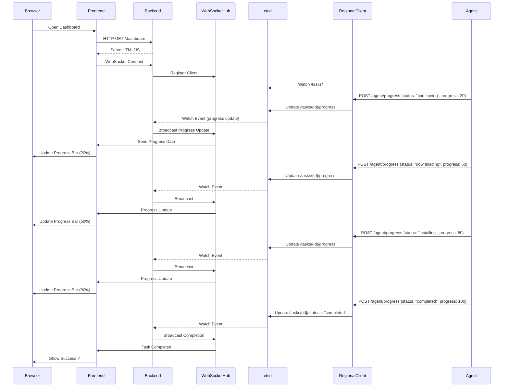

# LPMOS v2 - Full-Stack OS Provisioning Platform

## 1. Architecture Overview

### High-Level Architecture with Frontend

```
┌────────────────────────────────────────────────────────────────────────────┐
│                    Central Control Plane (Full-Stack)                       │
│  ┌──────────────────────────────────────────────────────────────────────┐  │
│  │                          Frontend UI                                  │  │
│  │  ┌────────────┐  ┌────────────┐  ┌────────────┐  ┌────────────┐    │  │
│  │  │ Dashboard  │  │  Tasks     │  │ Hardware   │  │  Approval  │    │  │
│  │  │   Page     │  │  Manager   │  │  Review    │  │   Page     │    │  │
│  │  └─────┬──────┘  └─────┬──────┘  └─────┬──────┘  └─────┬──────┘    │  │
│  │        │                │                │                │           │  │
│  │        └────────────────┴────────────────┴────────────────┘           │  │
│  │                          │ REST API + WebSocket                       │  │
│  └──────────────────────────┼──────────────────────────────────────────┘  │
│                             │                                              │
│  ┌──────────────────────────┼──────────────────────────────────────────┐  │
│  │                    Backend Server                                     │  │
│  │  ┌──────────────┐  ┌────▼────────┐  ┌──────────────┐               │  │
│  │  │   REST API   │  │  WebSocket  │  │ Orchestrator │               │  │
│  │  │   (Gin)      │  │   Hub       │  │              │               │  │
│  │  └──────┬───────┘  └─────┬───────┘  └──────┬───────┘               │  │
│  │         │                 │                 │                         │  │
│  │         └─────────────────┴─────────────────┘                         │  │
│  │                           │                                            │  │
│  │                  ┌────────▼─────────┐                                 │  │
│  │                  │  etcd Client     │                                 │  │
│  │                  └────────┬─────────┘                                 │  │
│  └───────────────────────────┼───────────────────────────────────────────┘  │
└────────────────────────────────┼─────────────────────────────────────────────┘
                                 │
                                 │ Watch/Update
                                 ▼
                    ┌─────────────────────────┐
                    │         etcd            │
                    │      (Cluster)          │
                    │                         │
                    │  /tasks/                │
                    │    {id}/metadata        │
                    │    {id}/status          │
                    │    {id}/hardware        │
                    │    {id}/progress        │◄────────┐
                    │    {id}/approval        │         │
                    │  /regions/              │         │
                    │  /agents/               │         │
                    └────────┬────────────────┘         │
                             │                          │
           ┌─────────────────┴─────────────────┐        │
           │                                   │        │
           │ Watch Tasks                       │        │
           ▼                                   ▼        │
┌──────────────────────────┐      ┌──────────────────────────┐
│ Regional Client (DC1)    │      │ Regional Client (DC2)    │
│  ┌────────────────────┐  │      │  ┌────────────────────┐  │
│  │ etcd Watcher       │  │      │  │ etcd Watcher       │  │
│  ├────────────────────┤  │      │  ├────────────────────┤  │
│  │ PXE/TFTP Server    │  │      │  │ PXE/TFTP Server    │  │
│  ├────────────────────┤  │      │  ├────────────────────┤  │
│  │ HTTP Boot Server   │  │      │  │ HTTP Boot Server   │  │
│  ├────────────────────┤  │      │  ├────────────────────┤  │
│  │ Agent API          │  │      │  │ Agent API          │  │
│  └────────┬───────────┘  │      │  └────────┬───────────┘  │
└───────────┼──────────────┘      └───────────┼──────────────┘
            │                                  │
            │ PXE Boot                         │ PXE Boot
            │ + Agent Deploy                   │ + Agent Deploy
            ▼                                  ▼
   ┌──────────────────┐               ┌──────────────────┐
   │  Bare Metal       │               │  Bare Metal       │
   │  Server           │               │  Server           │
   │  ┌────────────┐  │               │  ┌────────────┐  │
   │  │   Agent    │  │               │  │   Agent    │  │
   │  │ (Minimal)  │  │               │  │ (Minimal)  │  │
   │  │            │  │               │  │            │  │
   │  │ 1.Collect  │  │               │  │ 1.Collect  │  │
   │  │   Hardware │──┼───┐           │  │   Hardware │──┼───┐
   │  │ 2.Report   │  │   │           │  │ 2.Report   │  │   │
   │  │ 3.Install  │  │   │           │  │ 3.Install  │  │   │
   │  │ 4.Progress │──┼───┤           │  │ 4.Progress │──┼───┤
   │  └────────────┘  │   │           │  └────────────┘  │   │
   └──────────────────┘   │           └──────────────────┘   │
                          │                                  │
                          │ HTTP POST                        │
                          │ (Hardware/Progress)              │
                          ▼                                  ▼
                   Regional Client                    Regional Client
                          │                                  │
                          └──────────────┬───────────────────┘
                                         │
                                         │ Update etcd
                                         └─────────────────────┘
```

### Real-Time Data Flow (WebSocket)



## 2. Components

### 2.1 Control Plane (Full-Stack)

**Location**: Central data center or cloud

**Responsibilities**:
- **Backend**:
  - Expose REST API for task CRUD operations
  - Manage WebSocket connections for real-time updates
  - Watch etcd for task status and progress changes
  - Broadcast updates to connected frontend clients
  - Handle user authentication and authorization

- **Frontend**:
  - Dashboard page showing all tasks and their status
  - Task creation form with OS/region selection
  - Hardware review page showing collected info
  - Approval interface for confirming installations
  - Real-time progress monitoring with progress bars
  - WebSocket client for live updates

**Key Golang Packages**:
- `github.com/gin-gonic/gin` - HTTP server and routing
- `github.com/gorilla/websocket` - WebSocket support
- `go.etcd.io/etcd/client/v3` - etcd client
- `embed` - Embed frontend static files
- `html/template` - Server-side rendering

**Frontend Technology**:
- HTML5 for structure
- Vanilla JavaScript for interactivity
- WebSocket API for real-time updates
- CSS for styling (embedded or inline)

**Communication**:
- Inbound: HTTP from browsers, WebSocket connections
- Outbound: etcd read/write/watch operations
- Real-time: WebSocket broadcast to all connected clients

### 2.2 Regional Client (Unchanged from v1, with progress support)

**Added Functionality**:
- Accept agent progress reports via `/api/v1/agent/progress`
- Forward progress updates to etcd at `/tasks/{id}/progress`
- Support multiple progress stages (partitioning, downloading, installing, configuring)

### 2.3 Agent (Minimal, stdlib-focused)

**Location**: Runs in-memory on target bare-metal server

**Design Philosophy**:
- Minimal binary size (<10MB) for fast PXE boot
- Use only Go stdlib where possible
- No external dependencies for core functionality
- Single static binary

**Responsibilities**:
1. **Hardware Collection** (stdlib only):
   - CPU: `runtime.NumCPU()`, `/proc/cpuinfo`
   - Memory: `syscall.Sysinfo()`, `/proc/meminfo`
   - Disks: `os.ReadDir("/sys/block")`, `/proc/partitions`
   - Network: `os.ReadDir("/sys/class/net")`, `net.Interfaces()`
   - BIOS: Read `/sys/class/dmi/id/*`

2. **Reporting** (stdlib only):
   - Use `net/http` standard client
   - Simple JSON encoding with `encoding/json`
   - POST to regional client endpoint

3. **Installation** (stdlib + os/exec for commands):
   - Partition disks: `os/exec` calling `fdisk`/`parted`
   - Download OS images: `net/http` with progress
   - Extract/install: `os/exec` calling `tar`/`rsync`
   - Configure boot: `os/exec` calling `grub-install`

4. **Progress Reporting**:
   - Send updates at each stage
   - Report percentage completion
   - Include detailed messages

**Key Stdlib Packages**:
- `net/http` - HTTP client for reporting
- `encoding/json` - JSON marshaling
- `os` - File operations
- `os/exec` - Execute system commands
- `syscall` - System calls for hardware info
- `runtime` - Runtime information
- `io` - I/O utilities
- `fmt` - String formatting

**Agent Workflow**:
```go
func main() {
    // 1. Collect hardware
    hw := collectHardware()

    // 2. Report to regional client
    reportHardware(hw)

    // 3. Wait for approval (poll or long-poll)
    waitForApproval()

    // 4. Execute installation with progress
    installOS()
}

func installOS() {
    stages := []Stage{
        {"partitioning", 0, 20, partitionDisks},
        {"downloading", 20, 60, downloadOS},
        {"installing", 60, 90, installPackages},
        {"configuring", 90, 100, configureSystem},
    }

    for _, stage := range stages {
        reportProgress(stage.name, stage.start)
        stage.fn()
        reportProgress(stage.name, stage.end)
    }
}
```

## 3. etcd Key Schema (Enhanced)

### Hierarchical Structure

```
/lpmos/
├── tasks/
│   ├── {task_id}/
│   │   ├── metadata          # Task configuration (JSON)
│   │   ├── status            # Current status (string)
│   │   ├── hardware          # Reported hardware info (JSON)
│   │   ├── approval          # Approval status (JSON)
│   │   ├── progress          # Installation progress (JSON) ← NEW
│   │   │   {
│   │   │     "stage": "downloading",
│   │   │     "percentage": 45,
│   │   │     "message": "Downloading Ubuntu 22.04 image...",
│   │   │     "updated_at": "2026-01-29T10:15:30Z"
│   │   │   }
│   │   ├── logs              # Installation logs (string)
│   │   └── error             # Error information (JSON)
│   └── ...
├── regions/
│   ├── {region_id}/
│   │   ├── client/
│   │   │   ├── heartbeat     # Last heartbeat timestamp
│   │   │   ├── status        # online/offline
│   │   │   └── capabilities  # Supported OS, services (JSON)
│   │   └── tasks/            # Task assignments (TTL keys)
│   │       └── {task_id}     # Empty key for assignment
│   └── ...
├── agents/
│   ├── {mac_address}/
│   │   ├── info              # Agent metadata (JSON)
│   │   ├── last_seen         # Timestamp
│   │   └── task_id           # Associated task
│   └── ...
└── config/
    ├── global/               # Global configuration
    └── templates/            # Preseed/kickstart templates
```

### Progress Schema

```json
{
  "task_id": "550e8400-e29b-41d4-a716-446655440000",
  "stage": "downloading",
  "percentage": 45,
  "message": "Downloading Ubuntu 22.04 image (450MB / 1000MB)",
  "details": {
    "bytes_downloaded": 471859200,
    "bytes_total": 1048576000,
    "speed_mbps": 125
  },
  "updated_at": "2026-01-29T10:15:30Z"
}
```

### Watch Patterns for Real-Time Updates

**Control Plane Backend** watches:
- `/lpmos/tasks/` with prefix - All task changes
- `/lpmos/tasks/{task_id}/progress` - Progress updates for WebSocket broadcast
- `/lpmos/tasks/{task_id}/status` - Status changes

**Frontend** receives via WebSocket:
- Progress updates (broadcasted from backend)
- Status changes (broadcasted from backend)
- Hardware reports (broadcasted from backend)

## 4. APIs

### 4.1 Backend REST API

**Base URL**: `http://localhost:8080/api/v1`

#### Create Task
```http
POST /api/v1/tasks
Content-Type: application/json

{
  "region_id": "dc1",
  "target_mac": "00:1a:2b:3c:4d:5e",
  "os_type": "ubuntu",
  "os_version": "22.04"
}

Response: 201 Created
{
  "task_id": "550e8400-...",
  "status": "pending"
}
```

#### Get Task with Progress
```http
GET /api/v1/tasks/{task_id}

Response: 200 OK
{
  "task_id": "550e8400-...",
  "status": "installing",
  "hardware": {...},
  "progress": {
    "stage": "downloading",
    "percentage": 45,
    "message": "Downloading OS image..."
  }
}
```

#### Approve Task
```http
PUT /api/v1/tasks/{task_id}/approve
Content-Type: application/json

{
  "approved": true,
  "notes": "Hardware verified"
}
```

### 4.2 WebSocket API

**Endpoint**: `ws://localhost:8080/ws`

**Client Connection**:
```javascript
const ws = new WebSocket('ws://localhost:8080/ws');

ws.onopen = () => {
  console.log('Connected to LPMOS');
  // Subscribe to specific task
  ws.send(JSON.stringify({
    type: 'subscribe',
    task_id: '550e8400-...'
  }));
};

ws.onmessage = (event) => {
  const data = JSON.parse(event.data);

  switch(data.type) {
    case 'progress':
      updateProgressBar(data.task_id, data.percentage);
      updateStatusMessage(data.message);
      break;
    case 'status':
      updateTaskStatus(data.task_id, data.status);
      break;
    case 'hardware':
      displayHardwareInfo(data.hardware);
      break;
  }
};
```

**Server Messages**:
```json
// Progress update
{
  "type": "progress",
  "task_id": "550e8400-...",
  "percentage": 45,
  "stage": "downloading",
  "message": "Downloading OS image..."
}

// Status change
{
  "type": "status",
  "task_id": "550e8400-...",
  "status": "completed"
}

// Hardware report
{
  "type": "hardware",
  "task_id": "550e8400-...",
  "hardware": {...}
}
```

### 4.3 Frontend Routes

```
GET  /                    # Dashboard (main page)
GET  /dashboard           # Alias for dashboard
GET  /tasks               # Task list page
GET  /tasks/create        # Task creation form
GET  /tasks/{id}          # Task detail page
GET  /tasks/{id}/approve  # Approval page
GET  /static/*            # Static assets (CSS, JS, images)
```

### 4.4 Agent API (Regional Client)

```http
POST /api/v1/agent/report
Content-Type: application/json

{
  "mac_address": "00:1a:2b:3c:4d:5e",
  "hardware": {...}
}

POST /api/v1/agent/progress
Content-Type: application/json

{
  "mac_address": "00:1a:2b:3c:4d:5e",
  "task_id": "550e8400-...",
  "stage": "downloading",
  "percentage": 45,
  "message": "Downloading OS image..."
}

GET /api/v1/agent/approval/{mac_address}
Response:
{
  "approved": true,
  "task_id": "550e8400-..."
}
```

## 5. Frontend Implementation

### 5.1 Dashboard Page Structure

```html
<!DOCTYPE html>
<html>
<head>
    <title>LPMOS Dashboard</title>
    <style>
        /* Minimal CSS for clean UI */
        .task-card { border: 1px solid #ccc; padding: 10px; margin: 10px; }
        .progress-bar { width: 100%; height: 20px; background: #f0f0f0; }
        .progress-fill { height: 100%; background: #4CAF50; transition: width 0.3s; }
        .status-pending { color: orange; }
        .status-installing { color: blue; }
        .status-completed { color: green; }
        .status-failed { color: red; }
    </style>
</head>
<body>
    <h1>LPMOS Dashboard</h1>

    <div id="tasks-container">
        <!-- Tasks will be inserted here -->
    </div>

    <script>
        // WebSocket connection
        const ws = new WebSocket('ws://' + location.host + '/ws');

        ws.onmessage = (event) => {
            const data = JSON.parse(event.data);
            handleUpdate(data);
        };

        function handleUpdate(data) {
            if (data.type === 'progress') {
                updateProgress(data.task_id, data.percentage, data.message);
            } else if (data.type === 'status') {
                updateStatus(data.task_id, data.status);
            }
        }

        function updateProgress(taskId, percentage, message) {
            const progressBar = document.querySelector(`#task-${taskId} .progress-fill`);
            const progressText = document.querySelector(`#task-${taskId} .progress-text`);

            if (progressBar) {
                progressBar.style.width = percentage + '%';
                progressText.textContent = message + ' (' + percentage + '%)';
            }
        }

        // Load tasks on page load
        fetch('/api/v1/tasks')
            .then(res => res.json())
            .then(data => renderTasks(data.tasks));
    </script>
</body>
</html>
```

## 6. Security Considerations

### 6.1 WebSocket Security
- Use WSS (WebSocket over TLS) in production
- Implement authentication via token in WebSocket handshake
- Validate all messages from clients
- Rate limiting to prevent DoS

### 6.2 Agent Security
- Embed unique token in agent binary per task
- Token expires after task completion
- TLS for all HTTP communications
- Verify regional client certificate

### 6.3 Frontend Security
- CSRF protection for API endpoints
- XSS prevention (sanitize all user input)
- Content Security Policy (CSP) headers
- Rate limiting on API endpoints

## 7. Performance Optimization

### 7.1 WebSocket Hub
- Connection pool management
- Message buffering
- Graceful degradation if WebSocket unavailable
- Automatic reconnection logic

### 7.2 etcd Watches
- Single watch per prefix, not per key
- Batch updates before broadcasting
- Use watch filters to reduce events

### 7.3 Frontend
- Lazy loading for large task lists
- Virtual scrolling for long lists
- Debounce progress updates (max 1 update per second)
- Local caching with service workers

## 8. Agent Implementation Details

### 8.1 Hardware Collection (stdlib only)

```go
// CPU info using runtime and /proc
func collectCPU() CPUInfo {
    cores := runtime.NumCPU()

    // Read /proc/cpuinfo for model
    data, _ := os.ReadFile("/proc/cpuinfo")
    lines := strings.Split(string(data), "\n")
    var model string
    for _, line := range lines {
        if strings.HasPrefix(line, "model name") {
            model = strings.TrimSpace(strings.Split(line, ":")[1])
            break
        }
    }

    return CPUInfo{Model: model, Cores: cores}
}

// Memory using syscall.Sysinfo
func collectMemory() MemoryInfo {
    var si syscall.Sysinfo_t
    syscall.Sysinfo(&si)

    totalGB := int(si.Totalram * uint64(si.Unit) / 1024 / 1024 / 1024)
    return MemoryInfo{TotalGB: totalGB}
}

// Disks using /sys/block
func collectDisks() []DiskInfo {
    entries, _ := os.ReadDir("/sys/block")
    var disks []DiskInfo

    for _, e := range entries {
        if strings.HasPrefix(e.Name(), "loop") {
            continue
        }

        // Read size from /sys/block/{dev}/size
        sizeData, _ := os.ReadFile("/sys/block/" + e.Name() + "/size")
        sizeBlocks, _ := strconv.ParseInt(strings.TrimSpace(string(sizeData)), 10, 64)
        sizeGB := int(sizeBlocks * 512 / 1024 / 1024 / 1024)

        disks = append(disks, DiskInfo{
            Device: "/dev/" + e.Name(),
            SizeGB: sizeGB,
        })
    }

    return disks
}

// Network using net package
func collectNetwork() []NetworkInfo {
    interfaces, _ := net.Interfaces()
    var networks []NetworkInfo

    for _, iface := range interfaces {
        if iface.Flags&net.FlagLoopback != 0 {
            continue
        }

        networks = append(networks, NetworkInfo{
            Interface: iface.Name,
            MAC:       iface.HardwareAddr.String(),
        })
    }

    return networks
}
```

### 8.2 Installation with Progress

```go
func installOS(config InstallConfig) error {
    stages := []struct {
        name     string
        start    int
        end      int
        fn       func() error
    }{
        {"partitioning", 0, 20, func() error {
            reportProgress("partitioning", 0, "Creating partitions...")
            cmd := exec.Command("parted", "-s", config.Disk, "mklabel", "gpt")
            cmd.Run()
            // More partitioning commands...
            reportProgress("partitioning", 20, "Partitions created")
            return nil
        }},
        {"downloading", 20, 60, func() error {
            return downloadOSImage(config.OSImageURL, config.Disk)
        }},
        {"installing", 60, 90, func() error {
            reportProgress("installing", 60, "Extracting OS files...")
            // Extract and install
            reportProgress("installing", 90, "Installation complete")
            return nil
        }},
        {"configuring", 90, 100, func() error {
            reportProgress("configuring", 90, "Configuring bootloader...")
            // Configure grub, network, etc.
            reportProgress("configuring", 100, "Configuration complete")
            return nil
        }},
    }

    for _, stage := range stages {
        if err := stage.fn(); err != nil {
            return fmt.Errorf("%s failed: %w", stage.name, err)
        }
    }

    return nil
}

func downloadOSImage(url, dest string) error {
    reportProgress("downloading", 20, "Starting download...")

    resp, err := http.Get(url)
    if err != nil {
        return err
    }
    defer resp.Body.Close()

    out, err := os.Create(dest)
    if err != nil {
        return err
    }
    defer out.Close()

    // Download with progress
    total := resp.ContentLength
    downloaded := int64(0)
    buf := make([]byte, 32*1024)

    for {
        n, err := resp.Body.Read(buf)
        if n > 0 {
            out.Write(buf[:n])
            downloaded += int64(n)

            // Report progress every 5%
            percentage := int(20 + (float64(downloaded)/float64(total))*40)
            if percentage%5 == 0 {
                msg := fmt.Sprintf("Downloaded %d MB / %d MB",
                    downloaded/1024/1024, total/1024/1024)
                reportProgress("downloading", percentage, msg)
            }
        }
        if err == io.EOF {
            break
        }
        if err != nil {
            return err
        }
    }

    reportProgress("downloading", 60, "Download complete")
    return nil
}
```

## 9. Deployment

### 9.1 Control Plane Deployment

```bash
# Build
go build -o control-plane cmd/control-plane/main.go

# Run with TLS
./control-plane \
  --etcd-endpoints=etcd1:2379,etcd2:2379,etcd3:2379 \
  --listen-addr=:8080 \
  --tls-cert=/etc/lpmos/server.crt \
  --tls-key=/etc/lpmos/server.key
```

### 9.2 Agent Deployment

```bash
# Build minimal static binary
CGO_ENABLED=0 GOOS=linux GOARCH=amd64 go build \
  -ldflags="-s -w" \
  -o agent cmd/agent/main.go

# Should be <10MB
ls -lh agent

# Embed in initramfs
mkdir -p initramfs/bin
cp agent initramfs/bin/
cd initramfs && find . | cpio -o -H newc | gzip > ../initramfs.img
```

## 10. Testing

### 10.1 End-to-End Test Flow

1. Start etcd: `docker-compose up etcd`
2. Start control plane: `go run cmd/control-plane/main.go`
3. Start regional client: `REGION_ID=dc1 go run cmd/regional-client/main.go`
4. Open browser: `http://localhost:8080`
5. Create task via UI
6. Simulate agent: `go run cmd/agent/main.go` (in demo mode)
7. Watch real-time progress in dashboard
8. Approve via UI
9. Watch installation progress
10. Verify completion

### 10.2 Load Testing

- Use `gorilla/websocket` test client to simulate 1000+ concurrent connections
- Measure WebSocket broadcast latency
- Test etcd watch performance under load
- Verify no message loss during high-frequency updates
